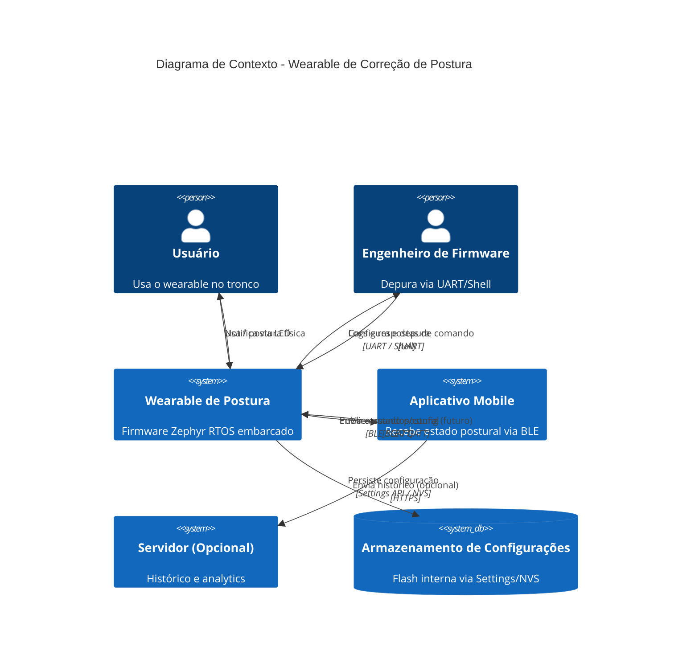
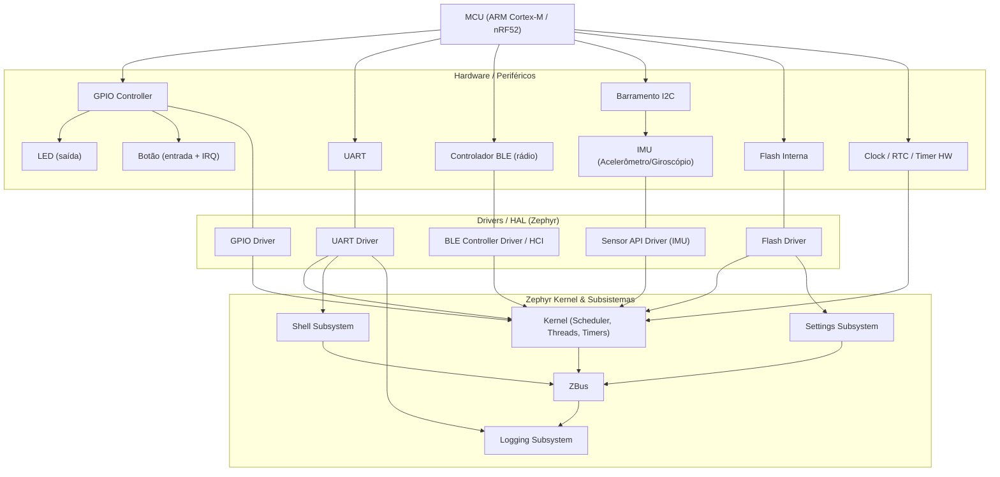
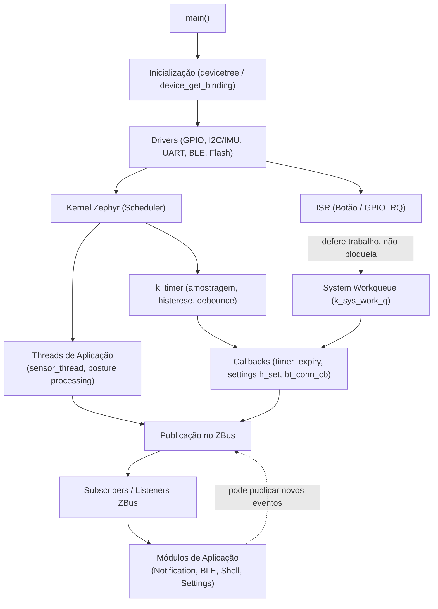
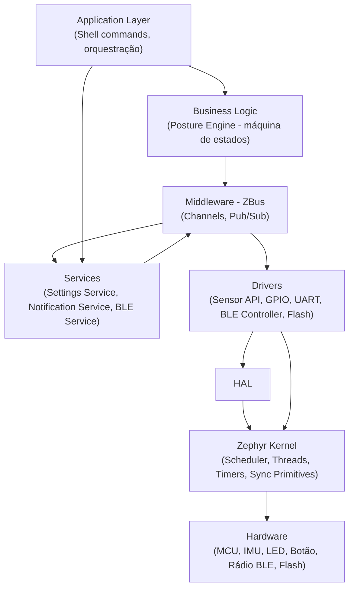
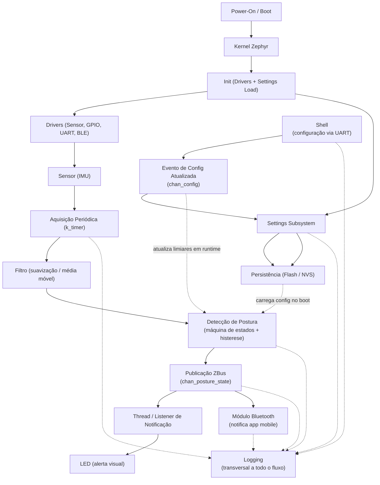
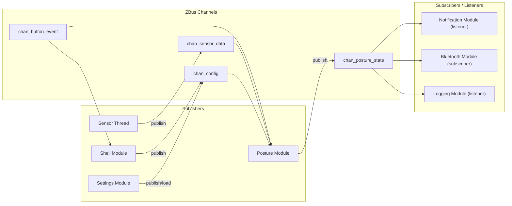
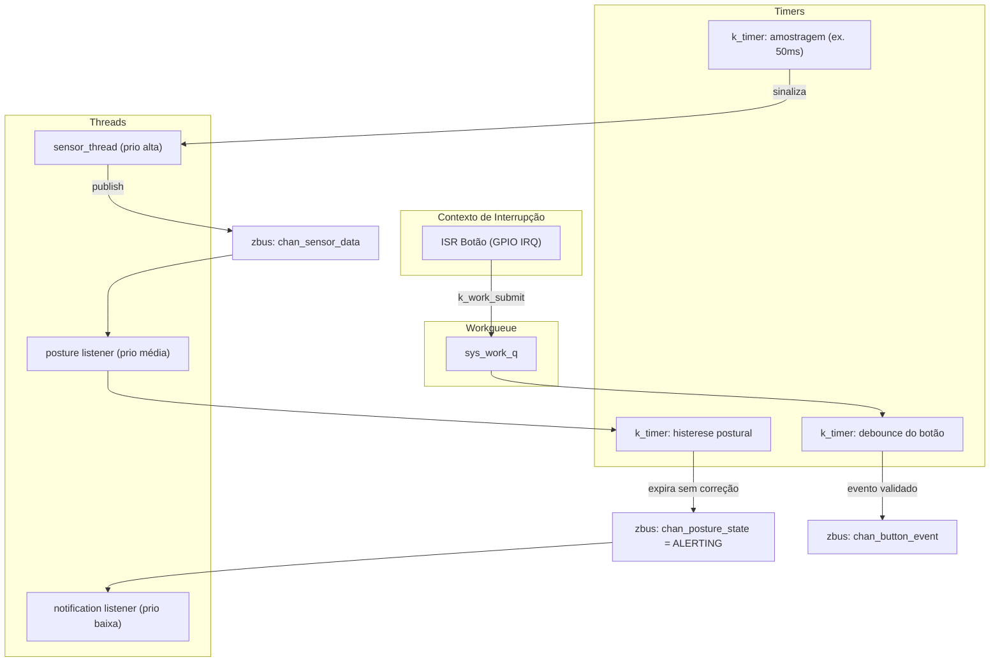
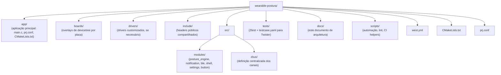
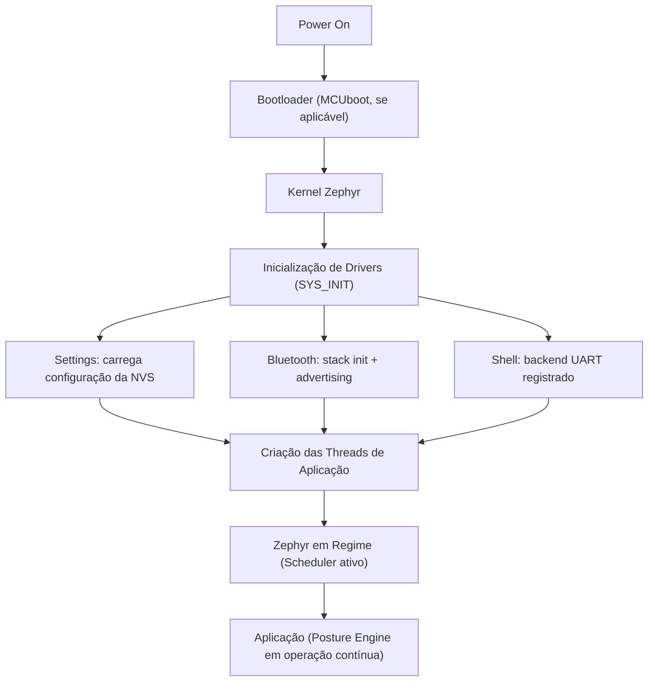

# Arquitetura do Firmware — Wearable Inteligente para Correção de Postura

> Documento de arquitetura produzido segundo a metodologia descrita em **Making Embedded Systems** (Elecia White), Capítulo 2 — *Understanding the System*. O objetivo deste documento é construir o modelo arquitetural completo do firmware **antes** de qualquer implementação, sobre **Zephyr RTOS**.

---

# Parte 1 — Análise do Sistema (Pré-Diagramação)

Antes de desenhar qualquer diagrama, é necessário entender o problema em profundidade. Esta seção segue rigorosamente os 18 pontos de análise solicitados. Cada item é justificado, não apenas listado.

## 1. Entendimento do Problema

O dispositivo é um **wearable de tronco** (preso ao peito ou à altura do esterno/coluna) cujo objetivo é **monitorar a postura corporal em tempo real** e **notificar o usuário** quando a postura permanecer incorreta por tempo prolongado.

O problema central não é apenas "ler um sensor de inclinação" — é um problema de **sistema de controle com histerese temporal e feedback ao usuário**, operando sob restrições severas de:

- **energia** (bateria pequena, uso contínuo o dia inteiro),
- **tempo real soft** (a detecção de inclinação deve ser responsiva, mas não crítica em microssegundos),
- **persistência de configuração** (limites de inclinação, tempos de tolerância devem sobreviver a reboots),
- **observabilidade** (o firmware precisa ser depurável em campo via Shell/UART/logs),
- **extensibilidade** (a arquitetura deve comportar futuras integrações com app mobile via BLE).

Não é um sistema de segurança crítica (falha não causa dano físico), mas é um sistema que precisa ser **confiável o suficiente** para não gerar falsos positivos/negativos constantes, sob pena do usuário abandonar o uso do produto.

## 2. Definição dos Objetivos

| Objetivo | Tipo |
|---|---|
| Detectar inclinação postural inadequada do tronco | Funcional primário |
| Notificar o usuário (visual/tátil/BLE) após período de postura incorreta sustentada | Funcional primário |
| Permitir configuração de limiares e tempos via Shell | Funcional |
| Persistir configurações entre reinicializações | Funcional |
| Comunicar eventos internos via barramento de mensagens (zbus) | Arquitetural |
| Fornecer observabilidade via logging estruturado | Não funcional (manutenibilidade) |
| Ser testável unitariamente (Ztest) e em CI (Twister) | Não funcional (qualidade) |
| Minimizar consumo de energia | Não funcional (operacional) |
| Permitir evolução para comunicação com app mobile (BLE) | Estratégico/futuro |

A priorização aqui segue o princípio do livro: **separar "o que o produto deve fazer" de "como o firmware deve ser organizado"**. Os dois primeiros objetivos são requisitos de produto; os demais são requisitos de engenharia que garantem que o produto possa evoluir sem reescrita.

## 3. Definição das Restrições

- **Hardware**: MCU classe Cortex-M (ex.: Nordic nRF52, compatível com Zephyr), IMU (acelerômetro/giroscópio) via I2C ou SPI, 1 LED, 1 botão, UART de debug, rádio BLE.
- **Energia**: bateria de pequena capacidade (uso diário, recarga noturna esperada) → exige uso de baixo-consumo do BLE (advertising/connection intervals longos), sleep entre amostragens do IMU, e LED com duty cycle baixo.
- **Tempo real**: soft real-time. A amostragem do IMU precisa ocorrer em cadência regular (ex.: 10–50 Hz), mas o sistema tolera jitter de alguns milissegundos.
- **Memória**: RAM/Flash restritas (~256KB RAM, ~1MB Flash típico de nRF52832/52840) → impõe módulos pequenos, evitar alocação dinâmica, preferir buffers estáticos e zbus (que não aloca dinamicamente).
- **Ambiente de execução único**: o RTOS é Zephyr — todas as decisões de concorrência devem usar primitivas nativas (k_thread, k_timer, k_work, zbus, k_mutex).
- **Regulatório/Segurança**: este é um dispositivo de uso pessoal não médico — não há requisito de certificação médica, mas há expectativa de segurança básica de BLE (pareamento, não exposição de dados sensíveis sem autenticação).
- **Metodológica**: a arquitetura deve obrigatoriamente contemplar Logging, Shell, Settings, ZBus, ZTest e Twister, conforme requisito do projeto.

## 4. Levantamento dos Requisitos Funcionais

- RF01 — O sistema deve amostrar continuamente os dados de orientação do tronco (IMU).
- RF02 — O sistema deve calcular o ângulo de inclinação a partir dos dados brutos do sensor.
- RF03 — O sistema deve comparar o ângulo calculado com um limiar configurável.
- RF04 — O sistema deve medir por quanto tempo a postura permanece fora do limiar (histerese temporal).
- RF05 — O sistema deve notificar o usuário (LED, e futuramente vibração/BLE) quando o tempo de postura incorreta exceder um valor configurável.
- RF06 — O sistema deve permitir configuração de limiares e tempos via Shell (UART).
- RF07 — O sistema deve persistir essas configurações em memória não volátil (Settings/NVS).
- RF08 — O sistema deve permitir ao usuário resetar/reconhecer um alerta via botão físico.
- RF09 — O sistema deve expor estado e eventos de postura via uma interface de comunicação (BLE preferencialmente).
- RF10 — O sistema deve registrar logs de eventos relevantes (boot, mudança de estado postural, erros de driver, configuração alterada).
- RF11 — O sistema deve ser testável de forma automatizada (Ztest) e integrável a pipelines de CI (Twister).

## 5. Levantamento dos Requisitos Não Funcionais

- RNF01 — **Modularidade**: cada responsabilidade (aquisição, processamento, notificação, comunicação, persistência) deve residir em módulo isolado, comunicando-se por zbus, não por chamadas diretas acopladas.
- RNF02 — **Baixo consumo energético**: amostragem e comunicação devem respeitar duty cycles configuráveis.
- RNF03 — **Observabilidade**: todo módulo relevante deve emitir logs com níveis apropriados (ERR/WRN/INF/DBG) via subsistema de Logging do Zephyr.
- RNF04 — **Configurabilidade em campo**: parâmetros operacionais devem ser ajustáveis sem reflash, via Shell.
- RNF05 **Persistência confiável**: configurações devem sobreviver a reset/power-cycle, usando Settings + backend NVS.
- RNF06 — **Testabilidade**: lógica de negócio (cálculo de ângulo, máquina de estados de postura) deve ser isolada de drivers de hardware para permitir testes unitários (Ztest) executáveis em native_sim, integrados ao Twister.
- RNF07 — **Desacoplamento temporal**: produtores e consumidores de eventos não devem bloquear-se mutuamente — justifica zbus com listeners assíncronos/observers.
- RNF08 — **Manutenibilidade/Coding Style**: aderência ao Zephyr Coding Style (clang-format, nomenclatura, estrutura de diretórios padrão de módulo).
- RNF09 — **Extensibilidade**: a arquitetura deve admitir novos sensores ou canais de notificação sem alterar os módulos centrais (Open/Closed).

## 6. Identificação dos Módulos do Firmware

| Módulo | Responsabilidade |
|---|---|
| `app_main` | Boot, inicialização de subsistemas, orquestração inicial |
| `sensor_driver` (ou shim sobre Sensor API) | Abstrai leitura do IMU |
| `posture_engine` | Calcula ângulo, aplica filtro, decide estado postural (máquina de estados) |
| `notification_module` | Traduz eventos de postura em estímulos (LED, futura vibração) |
| `ble_module` | Expõe estado via GATT, notifica app mobile |
| `shell_module` | Comandos de configuração e diagnóstico via Shell |
| `settings_module` | Carrega/salva configuração persistente (limiares, tempos) |
| `button_module` | Trata entrada do usuário (debouce, longa/curta pressão) |
| `logging` (infra, não módulo de negócio) | Observabilidade transversal |
| `zbus_channels` | Definição centralizada dos canais de mensagens |

Esta decomposição segue o princípio de **information hiding** do livro: cada módulo expõe uma interface mínima e oculta detalhes de implementação (ex.: `posture_engine` não sabe se o sensor é I2C ou SPI).

## 7. Identificação dos Periféricos

- **IMU** (acelerômetro 3 eixos, possivelmente + giroscópio) — via I2C (mais comum em wearables, menor contagem de pinos) ou SPI.
- **LED** — GPIO de saída, indicador visual de alerta/status.
- **Botão** — GPIO de entrada com interrupção (EXTI), para ack/reset/mode toggle.
- **UART** — debug console + Shell backend.
- **Rádio BLE** — controlador integrado ao SoC (ex.: nRF52 softdevice/controller) — interface de comunicação obrigatória escolhida.
- **Flash interna** — backend de armazenamento para Settings/NVS.
- **RTC/Timer de sistema** — base de tempo para o kernel e para os k_timer de amostragem/histerese.

## 8. Identificação das Interfaces

- **Interface Sensor ↔ Posture Engine**: leitura periódica de amostras (push via zbus ou pull via Sensor API + work item).
- **Interface Posture Engine ↔ Notification/BLE/Logging**: via canais zbus (publish/subscribe), garantindo desacoplamento.
- **Interface Usuário ↔ Sistema**: botão (entrada física) e LED (saída física); BLE (app mobile, bidirecional).
- **Interface Engenheiro ↔ Sistema**: UART Shell (configuração, diagnóstico, comandos de teste).
- **Interface Settings ↔ Flash**: API de Settings do Zephyr sobre backend NVS.

## 9. Identificação dos Fluxos de Informação

1. **Fluxo de aquisição**: Sensor → driver → estrutura de amostra → Posture Engine.
2. **Fluxo de decisão**: amostra filtrada → comparação com limiar → transição de estado → evento publicado.
3. **Fluxo de notificação**: evento de estado → Notification Module → LED; evento de estado → BLE Module → app mobile.
4. **Fluxo de configuração (entrada)**: Shell (comando) → Settings Module → memória RAM de config ativa → NVS (persistência).
5. **Fluxo de configuração (saída/boot)**: NVS → Settings subsystem (callback de load) → módulos consumidores (Posture Engine) na inicialização.
6. **Fluxo de diagnóstico**: qualquer módulo → Logging → backend UART (e futuramente RTT/flash log).
7. **Fluxo de interação do usuário**: Botão (ISR) → debounce/workqueue → evento zbus → módulos interessados (ack de alerta, troca de modo).

## 10. Identificação dos Eventos do Sistema

- `EVT_SENSOR_SAMPLE_READY` — nova amostra do IMU disponível.
- `EVT_POSTURE_STATE_CHANGED` — transição entre `GOOD` ↔ `BAD` ↔ `ALERTING`.
- `EVT_POSTURE_ALERT_RAISED` — tempo de tolerância excedido.
- `EVT_POSTURE_ALERT_CLEARED` — postura corrigida ou ack do usuário.
- `EVT_BUTTON_PRESSED` (curta/longa).
- `EVT_CONFIG_UPDATED` — configuração alterada via Shell.
- `EVT_BLE_CONNECTED` / `EVT_BLE_DISCONNECTED`.
- `EVT_SYSTEM_ERROR` — falha de driver/sensor.

## 11. Identificação das Mensagens do ZBus

| Canal (zbus channel) | Payload | Publishers | Subscribers |
|---|---|---|---|
| `chan_sensor_data` | amostra bruta/filtrada (ax, ay, az, ângulo) | `sensor_thread` | `posture_engine` |
| `chan_posture_state` | enum {GOOD, BAD, ALERTING} + timestamp | `posture_engine` | `notification_module`, `ble_module`, `logging listener` |
| `chan_button_event` | enum {SHORT_PRESS, LONG_PRESS} | `button_module` (via workqueue) | `posture_engine` (ack), `shell_module` |
| `chan_config` | struct de configuração (limiar, tempo tolerância) | `settings_module`, `shell_module` | `posture_engine` |
| `chan_system_status` | enum {OK, SENSOR_FAULT, BLE_FAULT} | qualquer módulo | `logging listener`, `ble_module` |

Cada canal é definido com `ZBUS_CHAN_DEFINE`, com **listeners** para reações imediatas (ex.: LED) e **subscribers** com fila própria para processamento assíncrono (ex.: BLE, que pode bloquear por I/O de rádio).

## 12. Identificação dos Pontos de Concorrência

- **ISR do botão** escrevendo em estrutura compartilhada → mitigado publicando direto em zbus ou enfileirando em workqueue, nunca manipulando estado complexo na ISR.
- **Thread de amostragem do sensor** vs. **thread/listener de notificação** acessando configuração ativa (limiares) → mitigado tratando a config como **imutável por mensagem** (cópia via zbus) em vez de ponteiro compartilhado mutável.
- **Shell (contexto de thread do shell)** alterando configuração enquanto **Posture Engine** está lendo-a → mitigado via canal zbus `chan_config` (zbus já serializa acesso com mutex interno por canal) em vez de variável global.
- **Settings load (no boot)** concorrendo com primeiras amostras do sensor → mitigado garantindo que `settings_load()` complete antes de iniciar a thread de amostragem (ordem de inicialização determinística).
- **BLE stack (sua própria thread/contexto)** publicando/notificando enquanto a aplicação também acessa o mesmo canal → mitigado tratando BLE module como subscriber assíncrono, nunca acessando GATT diretamente de outro contexto.

## 13. Identificação das Threads

| Thread | Prioridade (sugerida) | Responsabilidade |
|---|---|---|
| `sensor_thread` | Alta (cooperativa, ex. 5) | Amostragem periódica do IMU, publica em `chan_sensor_data` |
| `posture_thread` (ou zbus listener context) | Média (7) | Consome amostras, executa filtro + máquina de estados, publica `chan_posture_state` |
| `notification_thread`/listener | Média-baixa (10) | Reage a `chan_posture_state`, aciona LED |
| `ble_thread` (gerenciada pelo subsistema BT do Zephyr) | Gerenciada pela stack | Consome eventos relevantes, expõe via GATT |
| `shell_thread` (gerenciada pelo subsistema Shell) | Gerenciada pela stack | Processa comandos do usuário/engenheiro |
| `sys_workq` (workqueue do sistema, reaproveitada) | Padrão | Processa trabalho diferido de ISR (botão) |

A separação entre `sensor_thread` (produção) e `posture_thread` (processamento) segue o padrão **pipeline desacoplado por fila de mensagens**, evitando que jitter de processamento afete a cadência de amostragem.

## 14. Identificação das Workqueues

- **System Workqueue** (`k_sys_work_q`): usada para tratar o trabalho diferido da ISR do botão (debounce, leitura de duração de pressão) — evita lógica pesada em contexto de interrupção.
- **Workqueue dedicada (opcional/futuro)** para operações de Flash/Settings que podem ter latência maior (escrita em NVS), evitando bloquear threads de tempo sensível.

## 15. Identificação dos Timers

- `k_timer` periódico de amostragem (ex.: 50–100 ms) — dispara leitura do IMU (diretamente ou via trigger para a `sensor_thread`).
- `k_timer` (ou contador de estado) de **histerese de postura incorreta** — inicia ao detectar inclinação fora do limiar, e se expira antes de uma correção, dispara `EVT_POSTURE_ALERT_RAISED`.
- `k_timer` de debounce do botão (curta vs. longa pressão).
- (Opcional) Timer de "lembrete repetido" — caso o alerta não seja reconhecido, repetir notificação periodicamente.

## 16. Identificação dos Callbacks

- Callback de interrupção do GPIO do botão (`gpio_add_callback`) → submete trabalho à workqueue.
- Callback de expiração do `k_timer` de amostragem → sinaliza a `sensor_thread` (semáforo) ou executa leitura direto se leve.
- Callback de expiração do `k_timer` de histerese → publica evento de alerta.
- Callback do subsistema Settings (`settings_load_subtree` com handler `h_set`) → aplica valores carregados aos módulos.
- Callback de conexão/desconexão BLE (`bt_conn_cb`).
- Listener callback do zbus (`ZBUS_LISTENER_DEFINE`) → execução síncrona rápida (ex.: atualizar LED).

## 17. Identificação dos Componentes Reutilizáveis

- **Driver/abstração do IMU**: isolado por uma interface própria (`posture_sensor_iface`) que encapsula a Sensor API do Zephyr — reutilizável caso o sensor físico mude.
- **Máquina de estados de postura**: lógica pura em C, sem dependência de hardware — reutilizável e testável em `native_sim`.
- **Filtro digital (ex.: média móvel/low-pass)**: componente genérico aplicável a qualquer sinal ruidoso, não exclusivo de postura.
- **Módulo de debounce de botão**: genérico, reaproveitável em qualquer projeto Zephyr.
- **Camada de definição de canais zbus**: padrão replicável para outros subsistemas orientados a evento.

## 18. Identificação dos Riscos Arquiteturais

| Risco | Impacto | Mitigação |
|---|---|---|
| Acoplamento direto entre driver de sensor e lógica de negócio | Dificulta testes e troca de sensor | Interface de abstração + zbus |
| Lógica pesada dentro de ISR | Latência de interrupção, instabilidade | Workqueue para deferir processamento |
| Configuração mutável compartilhada sem proteção | Race condition, corrupção de estado | zbus (mutex interno) / mensagens imutáveis |
| Falta de cobertura de teste em lógica crítica (cálculo de ângulo, histerese) | Bugs não detectados em campo | Ztest + Twister no CI, lógica pura desacoplada de HW |
| Esgotamento de bateria por polling agressivo do BLE/IMU | Baixa autonomia, insatisfação do usuário | Duty cycle configurável, sleep entre amostras |
| Falha de escrita em Settings/NVS (wear, corrupção) | Perda de configuração | Validação de valores lidos + defaults seguros (fallback) |
| Falta de padronização de logs | Dificuldade de debug em campo | Convenção de níveis de log por módulo, `LOG_MODULE_REGISTER` |
| Crescimento descontrolado de canais zbus | Complexidade de manutenção | Documentação centralizada dos canais (este documento + header único) |

---

# Parte 2 — Diagramas Arquiteturais

---

# Diagrama 1 — Contexto (C4-inspired)

## Objetivo

Apresentar o sistema em seu nível mais alto de abstração, mostrando como o **Wearable** se relaciona com os atores externos: o **usuário**, o **aplicativo mobile**, um **servidor opcional**, o **armazenamento de configurações** e o **engenheiro de firmware** durante depuração.

## Motivação Arquitetural

Antes de detalhar módulos internos, é necessário fixar a **fronteira do sistema**. Isso evita over-engineering interno para integrações que não existem e garante que toda comunicação externa (BLE, UART) seja tratada como interface de primeira classe, sujeita a contratos estáveis.

## Componentes

- **Usuário**: interage fisicamente (postura) e recebe notificações (LED/futuro feedback tátil/app).
- **Wearable**: o sistema embarcado em si.
- **Bluetooth LE**: canal de comunicação sem fio escolhido como interface obrigatória.
- **Aplicativo Mobile**: consumidor remoto do estado postural, possível fonte de configuração futura.
- **Servidor (opcional)**: agregação de histórico/analytics, fora do escopo imediato do firmware.
- **Armazenamento de Configurações**: memória não volátil interna (Flash/NVS via Settings).
- **Engenheiro de Firmware**: persona de debug/manutenção via UART/Shell.

## Fluxo de Funcionamento

O usuário usa o dispositivo → o wearable monitora continuamente → ao detectar desvio postural sustentado, gera alerta local (LED) e publica estado via BLE → o app mobile exibe/registra o estado e pode (futuramente) reenviar dados a um servidor → em paralelo, o engenheiro pode, via UART, inspecionar logs e ajustar configuração, que é persistida localmente.

## Decisões Arquiteturais

- BLE foi escolhido como interface de comunicação obrigatória (em vez de Wi-Fi/Ethernet) por ser o padrão de fato para wearables de baixo consumo.
- O servidor é modelado como **opcional/fora do core** para não impor dependência de conectividade backend na arquitetura do firmware.
- O canal de debug (UART/Shell) é modelado como interface de primeira classe, não como "extra", pois é requisito obrigatório do projeto.

## Vantagens

- Fronteiras de responsabilidade claras.
- Permite evoluir o app mobile/servidor sem alterar o núcleo do firmware (contrato via GATT).
- Acesso de debug isolado do fluxo operacional normal.

## Limitações

- Não detalha protocolo GATT específico (será definido em fase posterior de design de interface BLE).
- Servidor opcional não tem contrato definido nesta fase.

## Evoluções Futuras

- Definição de serviço/característica GATT customizado.
- Integração com servidor para histórico postural de longo prazo.
- Autenticação/pareamento seguro BLE (bonding).

## Código Mermaid

---

# Diagrama 2 — Diagrama de Blocos (Hardware/Firmware)

## Objetivo

Mostrar o firmware modelado em torno do hardware físico, evidenciando como cada periférico se conecta via driver/HAL ao restante do sistema.

## Motivação Arquitetural

O Capítulo 2 de *Making Embedded Systems* enfatiza modelar o sistema "de fora para dentro": primeiro o hardware disponível, depois os blocos de software que o abstraem. Isso evita desenhar software desconectado da realidade física do produto.

## Componentes

MCU, GPIO (LED/Botão), UART, Controlador BLE, IMU (I2C), Flash (Settings/NVS), Clock/Timer do sistema, Kernel Zephyr, ZBus, Shell, Logging.

## Fluxo de Funcionamento

O MCU centraliza os periféricos. GPIOs controlam LED e leem o botão. UART serve à Shell e ao Logging. O barramento I2C conecta o IMU. A Flash interna serve ao subsistema Settings. O Kernel Zephyr fornece threads/timers que orquestram tudo, e o ZBus é a espinha dorsal de comunicação entre os módulos de software que envolvem esses periféricos.

## Decisões Arquiteturais

- IMU conectado via **I2C** (menor contagem de pinos, adequado a wearables compactos) usando a **Sensor API** nativa do Zephyr (driver pronto), já que a interface de comunicação obrigatória (BLE) cobre o requisito de "driver manual" alternativo — não sendo necessário implementar I2C/SPI manual.
- BLE via controlador integrado ao SoC, gerenciado pela stack Bluetooth do Zephyr (HCI interno).
- Logging e Shell compartilham o backend UART por padrão (comum em boards Zephyr), mas são subsistemas logicamente independentes.

## Vantagens

- Reuso máximo de drivers e subsistemas nativos do Zephyr (menor risco, menor esforço).
- Clara separação entre HAL (driver) e lógica (módulos de aplicação).

## Limitações

- Dependência da qualidade do driver de Sensor API do fabricante do IMU escolhido.
- UART compartilhada entre Shell e Logging pode gerar contenção textual (mitigável com `LOG_MODE_DEFERRED` e backend dedicado se necessário).

## Evoluções Futuras

- Adicionar segundo sensor (ex.: giroscópio dedicado, sensor de temperatura).
- Mover Logging para backend RTT ou Flash circular buffer, liberando UART exclusivamente para Shell.

## Código Mermaid

---

# Diagrama 3 — Organigrama (Control Hierarchy)

## Objetivo

Mostrar **quem controla quem** em tempo de execução: a cadeia de inicialização e a hierarquia de controle entre `main()`, drivers, kernel, threads, workqueues, callbacks, timers, ISRs e a aplicação.

## Motivação Arquitetural

Entender hierarquia de controle é essencial para identificar **quem pode bloquear quem**, e onde estão os pontos de sincronização — fundamental para evitar deadlocks e inversões de prioridade.

## Componentes

`main()`, inicialização de drivers, kernel/scheduler, threads de aplicação, workqueue do sistema, callbacks de driver, timers, ISR do botão, publicação em ZBus, subscribers, módulos de aplicação.

## Fluxo de Funcionamento

`main()` inicializa drivers (via `device_get_binding`/devicetree), em seguida sobe os subsistemas (Settings, Shell, BLE), cria as threads de aplicação. O Kernel passa a escalonar threads conforme prioridade. ISRs (botão) deferem trabalho para a workqueue. Timers disparam callbacks que publicam eventos no ZBus. Subscribers reagem de forma assíncrona, mantendo a aplicação desacoplada da origem do evento.

## Decisões Arquiteturais

- `main()` atua apenas como **orquestrador de boot**, não contém lógica de negócio — após inicializar, sua thread pode até terminar ou ficar ociosa.
- ISR nunca acessa diretamente recursos do ZBus ou Settings — sempre defere via workqueue, respeitando a regra de "ISR curta".
- Recursos compartilhados (canal de configuração, estado postural) são protegidos implicitamente pelo mutex interno de cada canal zbus, eliminando necessidade de mutexes explícitos na maior parte dos casos.

## Vantagens

- Hierarquia de controle previsível e auditável.
- Baixo risco de deadlock por centralizar sincronização no zbus em vez de mutexes manuais espalhados.

## Limitações

- Em caso de necessidade de operações atômicas multi-canal (ex.: transação que envolve dois canais), seria necessário mutex explícito adicional — não coberto pela arquitetura básica.

## Evoluções Futuras

- Introdução de `k_mutex` dedicado caso surjam operações multi-recurso atômicas.
- Uso de `k_poll` para módulos que aguardam múltiplos eventos simultaneamente.

## Código Mermaid

---

# Diagrama 4 — Diagrama de Camadas

## Objetivo

Organizar o firmware em níveis de abstração, do hardware à aplicação, evidenciando isolamento, reuso e baixo acoplamento.

## Motivação Arquitetural

Camadas bem definidas permitem substituir hardware (novo sensor, novo MCU) ou reescrever lógica de negócio sem afetar as demais camadas — um requisito direto do RNF09 (extensibilidade) e RNF06 (testabilidade).

## Componentes

Application Layer, Business Logic, Services, Middleware (ZBus), Drivers, HAL, Zephyr Kernel, Hardware.

## Fluxo de Funcionamento

A camada de Aplicação (Shell commands, orquestração de alto nível) depende da Lógica de Negócio (máquina de estados postural), que depende de Serviços (Settings, Notification), que se comunicam via Middleware (ZBus) com os Drivers, que por sua vez dependem do HAL e do Kernel Zephyr sobre o Hardware.

## Decisões Arquiteturais

- ZBus é tratado como **middleware transversal**, não pertencendo exclusivamente a nenhuma camada — ele é o mecanismo de comunicação entre Serviços e Lógica de Negócio, e entre Lógica de Negócio e camada de notificação/comunicação.
- A Lógica de Negócio (posture engine) **não importa nenhum header de driver** — comunica-se exclusivamente via mensagens zbus, garantindo que possa ser compilada e testada em `native_sim`.

## Vantagens

- Alta coesão dentro de cada camada, baixo acoplamento entre camadas.
- Lógica de negócio testável isoladamente (Ztest sem hardware).
- Troca de hardware (ex.: outro IMU) afeta apenas Drivers/HAL.

## Limitações

- Indireção adicional (mensagens zbus) introduz pequena latência comparada a chamada direta — aceitável dado o caráter soft real-time do sistema.

## Evoluções Futuras

- Introdução de uma camada de "Policy" separada da máquina de estados, para regras de notificação mais sofisticadas (ex.: silenciar alertas em determinados horários).

## Código Mermaid

---

# Diagrama 5 — Rota do Firmware (Diagrama Mais Importante)

## Objetivo

Modelar o caminho completo de um evento, do boot até a persistência, passando por aquisição, processamento, decisão, notificação e comunicação.

## Motivação Arquitetural

Este diagrama amarra todos os anteriores em uma narrativa única e temporal, validando que a arquitetura proposta realmente resolve o problema de negócio (detecção e notificação de má postura) de ponta a ponta.

## Componentes

Boot, Kernel, Init, Drivers, Sensor, Aquisição, Filtro, Detecção de Postura, Publicação ZBus, Thread de Notificação, LED, Bluetooth, Shell, Logging, Settings, Persistência.

## Fluxo de Funcionamento

1. **Boot** → Kernel Zephyr inicializa → **Init** dos subsistemas (Settings carrega config persistida, drivers sobem).
2. **Sensor_thread** inicia ciclo de **Aquisição** periódica (via timer).
3. Amostra passa por **Filtro** (suavização) antes de avaliação.
4. **Posture Engine** (Detecção de Postura) compara contra limiar e aplica histerese temporal.
5. Mudança de estado é **publicada no ZBus** (`chan_posture_state`).
6. **Thread/Listener de Notificação** reage acionando o **LED**.
7. Em paralelo, o **módulo BLE** notifica o app mobile sobre o novo estado.
8. O **Shell** permite, a qualquer momento, alterar limiares — o que gera novo evento de config.
9. **Logging** registra cada transição relevante, de forma transversal a todo o fluxo.
10. Alterações de configuração são persistidas via **Settings** na Flash (**Persistência**).

## Decisões Arquiteturais

- O filtro é aplicado **antes** da máquina de estados, garantindo que ruído do sensor não gere alarmes falsos — decisão crítica de UX do produto.
- A histerese temporal (tempo mínimo em postura incorreta antes de alertar) é modelada como **parte da máquina de estados**, não como lógica solta, garantindo testabilidade determinística via Ztest.
- Logging é tratado como **transversal** (cross-cutting concern), anexado em cada etapa sem acoplar módulos entre si.

## Vantagens

- Rastreabilidade completa do dado, do sensor à notificação.
- Cada etapa é um ponto de extensão (ex.: trocar filtro, adicionar novo canal de notificação) sem reescrever o fluxo.

## Limitações

- Caminho relativamente longo (várias etapas assíncronas) pode introduzir latência perceptível se mal configurado (mitigado com timers e prioridades adequadas).

## Evoluções Futuras

- Adicionar machine learning leve (ex.: detecção de padrão de uso) na etapa de Detecção de Postura.
- Buffer de histórico circular para análise de tendência postural ao longo do dia.

## Código Mermaid

---

# Diagrama Extra — Arquitetura ZBus

## Objetivo

Detalhar a topologia de publishers, channels, subscribers e prioridades do barramento de mensagens, justificando a escolha de arquitetura orientada a eventos.

## Motivação Arquitetural

ZBus foi escolhido como requisito obrigatório do projeto e como solução natural para o RNF01 (modularidade) e RNF07 (desacoplamento temporal): produtores e consumidores não se conhecem, apenas o canal.

## Componentes

Sensor Thread, Posture Module, ZBus Channels, Notification Module, Bluetooth Module, Logging Module, Shell Module, Settings Module.

## Fluxo de Funcionamento

`sensor_thread` publica amostras → `posture_engine` consome, processa e publica novo estado → múltiplos subscribers (Notification, BLE, Logging) reagem de forma independente e paralela. `shell_module` e `settings_module` publicam atualizações de configuração no canal `chan_config`, consumido por `posture_engine`.

## Decisões Arquiteturais

- Uso de **listeners** (callback síncrono, rápido) para reações triviais (ex.: LED).
- Uso de **subscribers com fila própria** para módulos que podem ter latência variável (ex.: BLE, que depende de stack de rádio) — evita que um módulo lento atrase os demais.
- Canais definidos estaticamente (`ZBUS_CHAN_DEFINE`) em um header central (`zbus_channels.h`), evitando definição dispersa e descoberta implícita.

## Vantagens (vs. chamadas diretas)

| Orientado a Eventos (ZBus) | Chamadas Diretas |
|---|---|
| Módulos desacoplados, não se conhecem | Acoplamento forte (quem chama precisa do header de quem é chamado) |
| Fácil adicionar novo subscriber sem alterar o publisher | Adicionar novo consumidor exige alterar código do produtor |
| Testável: pode-se publicar mensagens sintéticas em teste | Teste exige mockar funções diretamente |
| Built-in thread-safety por canal | Necessidade de sincronização manual (mutex) ad-hoc |

## Limitações

- Latência marginal adicional por indireção de mensagens.
- Necessidade de disciplina para não deixar a quantidade de canais crescer sem documentação.

## Evoluções Futuras

- Uso de `zbus_chan_add_obs`/observers dinâmicos para módulos plugáveis (ex.: plugins de notificação customizados).

## Código Mermaid

---

# Diagrama Extra — Threads, Timers e Sincronização

## Objetivo

Detalhar threads, prioridades, workqueues, timers, ISRs, callbacks e mecanismos de sincronização, evidenciando riscos de concorrência.

## Motivação Arquitetural

Concorrência mal modelada é a fonte mais comum de bugs intermitentes em firmware. Mapear explicitamente esses elementos antes de codar reduz risco de race conditions e starvation.

## Componentes

`sensor_thread`, `posture listener/thread`, `notification listener`, `sys_workq`, `k_timer` (amostragem, histerese, debounce), ISR do botão, callbacks, fila zbus interna (substitui necessidade de semáforos/mutexes explícitos na maioria dos casos).

## Fluxo de Funcionamento

ISR do botão → submete trabalho à `sys_workq` → workqueue publica evento no zbus. `k_timer` de amostragem → sinaliza `sensor_thread` → publica amostra. `k_timer` de histerese, gerenciado internamente pela `posture_engine`, controla a transição para estado de alerta.

## Decisões Arquiteturais

- Não há necessidade de **semáforos ou mutexes explícitos** na maioria dos fluxos, pois o zbus já serializa acesso por canal — reduz superfície de erro de concorrência.
- Um **mutex explícito** só seria necessário se um módulo precisasse de consistência atômica entre múltiplos canais simultaneamente (não é o caso na v1).
- Prioridades de thread são organizadas de forma que aquisição de sensor tenha prioridade mais alta que notificação (dados não podem atrasar por causa de UI).

## Vantagens

- Modelo de concorrência simples, auditável, com poucos primitivos manuais.

## Limitações

- Se exigências de tempo real ficarem mais rígidas no futuro (ex.: amostragem a 1kHz), pode ser necessário revisar para uso de interrupções diretas + DMA.

## Possíveis Condições de Corrida (e Mitigações)

- **Botão pressionado durante escrita de config via Shell**: ambos publicam em canais diferentes; risco real é se ambos tentassem escrever a mesma variável global — mitigado por não existir variável global compartilhada mutável fora de canais zbus.
- **Leitura de configuração pela `posture_engine` durante atualização via Settings no boot**: mitigado garantindo ordem de inicialização (Settings carrega antes de threads de processamento iniciarem).
- **ISR reentrante do botão (bouncing mecânico)**: mitigado por debounce via `k_timer` antes de considerar o evento válido.

## Código Mermaid

---

# Diagrama Extra — Estrutura do Projeto

## Objetivo

Modelar a organização do repositório, alinhada às convenções de módulos out-of-tree do Zephyr.

## Motivação Arquitetural

Estrutura de diretórios previsível facilita onboarding, automação de CI (Twister) e separação entre código de aplicação, testes e infraestrutura de build.

## Componentes

`app/`, `boards/`, `drivers/`, `include/`, `src/`, `modules/`, `zbus/`, `tests/`, `docs/`, `scripts/`, `west.yml`, `CMakeLists.txt`, `prj.conf`.

## Fluxo de Funcionamento

`west.yml` define o manifesto de dependências (Zephyr + módulos externos). `CMakeLists.txt`/`prj.conf` configuram o build da aplicação em `app/`. Código-fonte de módulos vive em `src/modules/`, canais zbus centralizados em `src/zbus/`. Testes unitários ficam isolados em `tests/`, com seus próprios `testcase.yaml` para o Twister.

## Decisões Arquiteturais

- `modules/` contém cada módulo de negócio em subpastas próprias (`posture_engine/`, `notification/`, `ble/`, `shell/`, `settings/`, `button/`), reforçando a separação por responsabilidade definida na Parte 1.
- `zbus/` é isolado como diretório próprio por ser a espinha dorsal de comunicação, com header único de canais.
- `boards/` permite overlays de devicetree específicos por placa, sem modificar o Zephyr upstream.

## Vantagens

- Compatível com convenções de "Zephyr Application" e "Zephyr Module/Workspace" oficiais.
- Facilita integração com Twister (descoberta automática de `tests/*/testcase.yaml`).

## Limitações

- Requer disciplina para não acumular código solto em `app/src` fora da estrutura de módulos.

## Evoluções Futuras

- Extrair módulos maduros (ex.: `posture_engine`) como módulo Zephyr externo reutilizável via `west.yml` em outros projetos.

## Código Mermaid

---

# Diagrama Extra — Fluxo de Boot

## Objetivo

Modelar a sequência de inicialização do sistema, do power-on à aplicação em regime operacional normal.

## Motivação Arquitetural

Uma sequência de boot determinística evita condições de corrida na inicialização (ex.: thread de sensor iniciando antes da configuração ser carregada).

## Componentes

Power On, Bootloader, Kernel, Drivers, Settings, Bluetooth, Shell, Threads, Sistema Operacional (Zephyr em regime), Aplicação.

## Fluxo de Funcionamento

Energização → bootloader (se presente) → Kernel Zephyr assume → inicialização de drivers (via macros `DEVICE_DEFINE`/devicetree, em ordem de prioridade `SYS_INIT`) → Settings carrega configuração persistida → stack Bluetooth inicializa e começa advertising → Shell backend é registrado e fica disponível na UART → threads de aplicação (`sensor_thread`, etc.) são criadas e o scheduler começa a operar em regime estável → aplicação (lógica de postura) entra em operação contínua.

## Decisões Arquiteturais

- Settings é carregado **antes** de iniciar threads de processamento, garantindo que a primeira amostra já seja avaliada com os limiares corretos (não com defaults de fábrica).
- Bluetooth inicializa em paralelo/antes das threads de aplicação, mas eventos só são publicados para BLE depois que o módulo sinaliza pronto (subscriber registra-se antes de eventos relevantes ocorrerem).

## Vantagens

- Ordem de boot explícita reduz bugs de "depende da sorte do agendador" comuns em sistemas mal inicializados.

## Limitações

- Tempo total de boot é a soma sequencial dessas etapas — aceitável para um wearable (não há requisito de boot ultra-rápido tipo automotivo).

## Evoluções Futuras

- Paralelizar inicialização de Bluetooth e Settings via `SYS_INIT` com níveis apropriados, reduzindo tempo total de boot.

## Código Mermaid

---

# Conclusão

Este documento estabelece a arquitetura completa do firmware do **Wearable Inteligente para Correção de Postura** sobre **Zephyr RTOS**, cobrindo desde o contexto de produto até a sincronização interna de threads, sem qualquer linha de código de implementação. Todos os módulos obrigatórios (Logging, Shell, Settings, ZBus, ZTest, Twister) foram contemplados estruturalmente, assim como o hardware obrigatório (UART de debug, LED, botão, interface de comunicação BLE).

A próxima etapa natural, fora do escopo deste documento, é a tradução desta arquitetura em:

1. Estrutura de diretórios real do repositório.
2. Definição formal do devicetree/overlay da placa.
3. Headers de canais ZBus (`zbus_channels.h`).
4. Esqueleto dos módulos (`modules/*`) com `LOG_MODULE_REGISTER` e Kconfig próprios.
5. Primeiros testes Ztest da máquina de estados de postura, isolados de hardware.
